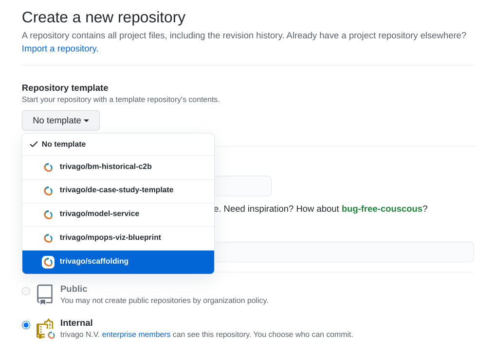

Scaffolding
===========


**Scaffolding is a setup that allows you to easily deploy Hive and Spark workflows
from your local computer into your personal Hadoop space, development and
production.**

It is intended to provide the necessary tools to create a fast development
cycle in which you can deploy and run your workflows fast after each
modification.

It consists of three parts:

* A Docker image that contains all the necessary configuration for trivago's
  HDFS, Hive, Oozie and Kerberos (mpops/hadoop-cli)
* This repository with an example project that you can use as a template or
  example for your own projects
* A set of commands to initialize, deploy and run your workflows
  (trv-scaffolding)

To use this repository the only dependency is to have Docker installed.

The Docker image
----------------

The Docker image gives you a command line that is configured to connect to
trivago's Hadoop cluster. You only have to pass your Kerberos keytab and
it will automatically map the contents of this repository to the `/app`
directory inside the container.

To start it, at the root of this repository, execute:
```
docker-compose run -v </PATH/TO/YOUR.KEYTAB>:/etc/krb5.keytab cmd bash
```
That will start a command line inside the container (you'll recognize that
because the prompt of the command line will become red):


### The /app directory

The current working directory when you start the container is `/app`. This
directory is mapped to the directory in your local machine where you have
this repository. That means that you can change anything in the code and the
changes will be immediately visible inside the container. The `/app` directory
is the only connection between your local machine filesystem and the Docker
container, all the rest of the directories inside the container are isolated
from whatever you have in your machine.

This repository
---------------

This repository can be used as a template or as an example for your own
projects. It contains two example workflows (a Hive one and a Spark one) to
showcase how a project can be configured.

When you're creating your own repository, select `trivago/scaffolding` from
`Repository template`:



The overall structure of the project is:

```
app/
├── db                            # generic database scripts that don't belong to any wf in particular
├── conf
│   ├── default.properties        # job.properties is created by merging `default.properties` and
│   ├── <user>.properties         # `<user>.properties` (if it exists). `<user>` is the keytab user.
│   └── env
│       └── requirements.txt      # Python dependencies of your application (always provide exact versions)
└── src                           # your application source code
    ├── app
    │   ├── <workflow-1>          # a workflow directory
    │   │   ├── run.py            # entrypoint of the Spark code
    │   │   └── workflow.xml
    │   ├── <workflow-2>          # another workflow directory
    │   │   └── workflow.xml
    │   └── coordinator.xml
    └── lib                       # generic code of your application
```

The provided example code should work out of the box and you should be able to
initialize, deploy and run it directly from the command line.

The two example workflows provided are:

* `example_hive_wf`: writes an UUID in the one-column table
  `<user>_scaffolding.uuids` table every time it is executed.
* `example_spark_wf`: writes timestamp in the one-column table
  `<user>_scaffolding.ticker` table every time it is executed.

Of course, you can just delete them and write your own. They are there just as
examples.

**Note**: The philosophy behind this structure is that you keep workflows
that are related to each other inside the same repository and unrelated
workflows in different ones. Sometimes there's a fuzzy boundary between
workflows that are related and the ones that are not. One good test to decide
when to put them together or not is to think if you need them to be always
deployed at the same time. If you could deploy them independently, chances are
that they can go into different repos.

The Scaffolding commands
------------------------

Inside the container you have the following main commands:

* `db-init`: initialize the database in a user space
* `deploy-src`: package and deploy your code
* `deploy-env`: deploy the Conda environment to HDFS (it will create it first if
  it doesn't exist.
* `submit`: run your workflow

With those, you can initialize your project's database, deploy your
dependencies, deploy your code and run it.

However, there more things that you can do:

* `create-env`: create your Conda environment without deploying it
* `export-src`: make a copy of your code that can be used in `hadoop-wf`
* `validate`: validate the syntax of your Oozie files
* `submit-coord`: run your coordinator

A typical development session using these commands might look like this:

1. Initialize the db with `db-init` (only once or anytime that
   there's a change in the schema of the db)
2. [Optional] Modify `conf/env/requirements.txt` and run `deploy-env` to package
   your project dependencies. You only have to do this when the
   `requirements.txt` file changes
3. Validate your Oozie files (only once or anytime your Oozie files change)
4. Work in your code
5. Deploy your code with `deploy-src`
6. Execute it with `submit`
7. Back to 4

After deploying your project using them, it will look like this:
```
/user/<user>/db/<project>.db      # Hive database
/user/<user>/<project>/src/       # unpackaged source code files + Oozie files
/user/<user>/<project>/src.zip    # packaged source to be used by PySpark workflows
/user/<user>/<project>/env.tar-gz # Conda environment with dependencies for PySpark workflows
/user/<user>/<project>/RELEASE    # Info on the user and timestamp of the deployment
```

And, by default, your Hive database will be named as:
```
<user>_<project>
```
although the name is configurable by just setting a `db` variable in the correct
properties file as described below.

**Note**: the Scaffolding commands are implemented as a Python package
[trv-scaffolding-lib](https://github.com/trivago/scaffolding-lib) which is
installed in the image by default.

## db-init

This command allows you to initialize the database of the project in your user
space. It works by providing a list of scripts that will be executed
sequentially to create the database, the tables and initializing them with data
if necessary.

To configure it, edit the `pyproject.toml` file at the root of the repository:
```
[tool.scaffolding]
project = "myproject"
db_init_scripts = [
    "db/create_db.sql",
    "src/app/example_spark_wf/tables/ticker.sql",
    "src/app/example_hive_wf/tables/uuids.sql",
]
```
Set the name of your project (important!) and the list of SQL scripts to be
executed to initialize the database.

Note:

* You can, of course, use either the `.sql` or `.hql` extension for the files.

* The script can be located anywhere inside the repository, just specify them
  with routes relative to its root. SQL scripts that are generic to all
  workflows in the repository can be stored in the top level `db/` folder:
  ```
  db/create_db.sql
  ```
  Tables that are particular to a specific workflow can be stored in the
  specific workflow folder:
  ```
  src/app/example_spark_wf/tables/ticker.sql
  ```

* Each SQL script is passed several variables that can be used to parametrize
  it:

  - `user`: environment in which the code will be run (the user of the current
    keytab, prod or dev).
  - `project`: the name of the project in the `pyproject.toml` file
  - `db`: the database name with the structure `<user>_<project>` (if `user` or
    `project` contain dashes, `-`, they are replaced by underscores `_` in this
    variable). You can override it in the properties file to set it to a
    specific name too.

   For example, to create a table, you can do:
   ```
   CREATE EXTERNAL TABLE {{ db }}.ticker (
       timestamp STRING
   )
   LOCATION 'hdfs://nameservice1/user/{{ user }}/db/{{ project }}.db/ticker';
   ```
   This allows to create the database and tables for each user of the repository
   in their own spaces without conflicting with each other.

   Note: You can use any [Jinja2 syntax](https://jinja.palletsprojects.com/en/2.11.x/templates/)
   in your SQL/HQL files which also includes `if` statements and loops.

**Important**: Note that SQL/HQL scripts can use both Jinja `{{ variable }}`
syntax and the traditional properties `${variable}` syntax, don't mix them!
Jinja variables are resolved _before_ being sent to Hive/HDFS, and properties
variables are kept as they are. So if you open one SQL/HQL file in HDFS,
you'll see the `${}` still there but all the `{{}}` variable will be already
replaced.

Once you have your scripts ready and listed in `pyproject.toml`, you can see a
preview of what will be sent to Hive with:
```
db-init
```
To actually execute them you have to do:
```
db-init --execute
```

**Important**: For now, Scaffolding won't delete the database for you if you
want to recreate it. For safety reasons you have to do that manually. So if you
want to start from a blank state, you can do something like:

You can get a Hive command line by executing `start-beeline`. Then you can
delete the database with:
```
DROP DATABASE <database_name> cascade;
```

Then you can delete the database files (if necessary) with:
```
hadoop fs -rm -r /user/<user>/db/<project>.db
```

## deploy-env

If you're using Scaffolding to deploy a Spark workflow, you have two options
when it comes to specify your dependencies:

* If you just need Spark and Pandas, and not any other external Python package,
  you can just point to workflow to an already prepared Conda environment by
  using this in your `workflow.xml` file:
  ```
  <archive>${nameNode}/user/dapa-tools/conda-envs/scaffolding-1.0.tar.gz#env</archive>
  ```
  Check `src/app/example_spark_wf/workflow.xml` as an example. Also, if this is
  the case, there's nothing else you need to do since the file is already
  available in HDFS.

* If your workflow makes use of additional Python packages, however, you can
  create and deploy a Conda environment with `deploy-env`.

To create your own Conda environment, you can specify the dependencies in the
`requirements.txt` file inside the repository:
```
conf/env/requirements.txt
```
At the bare minimum, you have to specify these two inside it:
```
python==3.7.4
pyspark==2.4.3
```
But you can also add any Python package that you want to use. For example, if
you want to use pandas, your `requirements.txt` file can look like this one:
```
python==3.7.4
pyspark==2.4.3
pandas==1.2.3
```
Remember to always specify the exact version you want to use to prevent the
workflow breaking because of changes in the dependencies.

Once you have your requirements file ready, you can execute:
```
deploy-env
```
This will create a Conda environment and place it at:
```
/user/<user>/<project>/env.tar.gz
```
so it will be available for all your Spark workflows.

Finally, you have to tell your `workflow.xml` to use it by adding this line:

    <archive>${nameNode}/user/${user}/${project}/env.tar.gz#env</archive>

Check `src/app/example_spark_wf/workflow.xml` as an example.

**Important**: executing `deploy-env` takes some time because the generated
Conda environment is a big file, notice however that you only have to use it if
you have Spark workflows and only when you change your dependencies in your
`requirements.txt` file. If you don't change your dependencies, you can deploy
the environment only once and just do `deploy-src` when you change your code.

## deploy-src

`deploy-src` is one of the most important commands in the set. It is the
one that allows you to deploy your code directly to HDFS and it will probably
the one that you execute the most if you use Scaffolding.

The command does four things:

* Copies your code to HDFS (`<your-project>/src/`) 
* Packages your code into a zip file that Spark workflows can use and copies it
  to HDFS (`<your-project>/src.zip`)
* Creates a copy of `job.properties` next to every `workflow.xml` and
  `coordinator.xml` file in HDFS
* If you use any Jinja templating in your sql/hql files, it performs all the
  variable substitutions before copying these files to HDFS (this includes all
  the `{{}}` variables and Jinja constructs, but not the `${}` ones).

### The command

To execute the command, you just have to type:
```
deploy-src
```
You'll see some output with the logs for the steps outlined above. Make sure you
read the next sections on how to configure your project for this command to work
correctly.

After the execution, your project will look like:
```
/user/<user>/<project>/src/
/user/<user>/<project>/src.zip
```

**Important**: Every time that you deploy, the contents of `src/` in HDFS are
deleted and replaced with the new version of the code. Never make manual changes
directly there or store anything in that folder as those modification will be
lost during next redeployment.

### Structure of the code

`deploy-src` doesn't make too many assumptions about the structure of your code,
it just deploys whatever you have in `src/`. And you can have any combination of
Hive and Spark workflows or just workflows of one kind or the other.

However, the following structure is recommended:
```
src                           # your application source code
├── app
│   ├── <wf-1>                # a subworkflow directory
│   │   ├── run.py            # entrypoint of the Spark code
│   │   └── workflow.xml
│   ├── <wf-2>                # another subworkflow directory
│   │   └── workflow.xml
│   ├── workflow.xml          # main workflow that combines wf-1 and wf-2
│   └── coordinator.xml
└── lib                       # non-business code of your application
    └── my_utility.py
```

* `app/`: contains all the business specific code (your Hive or Spark workflows)
* `lib/`: contains generic functions to be used across Spark workflows

The contents of the `workflow.xml` and `coordinator.xml` files are up to you.
However, examples are provided so you can see how to reference files such as
`src.zip` and `env.tar.gz` in your Spark workflows.

For PySpark workflows, it is a good idea to name `run.py` to the file that
serves as entrypoint of the workflow (the one referred from `workflow.xml`).

**Important**: All the content of `src/` is placed in the `PYTHONPATH`, that
means that you can import anything inside `src/` like this:
```
from app.my_worflow import foo
from lib.date_utils import bar
```

**Note**: If you have truly generic code, consider moving it to an actual
Python package instead of having it stored in `lib/`, and have it listed inside
your `requirements.txt` file. You can use the `lib/` folder for code that is
common across several workflows or as a first step before creating a Python
library when you are working on it very frequently and deploying a separate
package for every change is too much of a hassle.

### How job.properties is computed

Scaffolding allows you to parametrize the workflows for your personal user
without having to touch the production *properties* file. For example, you can
have a variable for which table should be used to export final results. That
can be set to the actual table in production, while it can be set to a local
table in your personal workspace for your own development.

All *property* files are saved in `conf/`, and the file:

    conf/default.properties

contains the default values that are used in all cases.

Then you can add your personal configuration or the configuration for your team
keytabs (either the `prod` or the `dev` one) as:

    conf/<keytab-username>.properties

that will override the values in `default.properties` when Scaffolding generates
the final `job.properties` file.

For example, if the current Kerberos user is `my-team-dev`, the files:
```
# default.properties
variable1=a
variable2=b
```
and:
```
# my-team-dev.properties
variable2=c
variable3=d
```
will generate the following `job.properties` file during deployment:
```
variable1=a
variable2=c
variable3=d
```

So, in summary, set the default values for your variables inside
`default.properties` and then add additional properties files for each
space/environment where you want the project to run: prod, dev or the Hadoop
users of the members of the team. Name each file after the Kerberos keytab of
each space and then the `job.properties` will be generated automatically upon
deployment (or when using `export-src`).

**Note**: if you want to see which properties will be actually used, just
execute `get-properties` in the command line and the final values will be
printed on the screen.

**Note**: when adding a `<kerberos-username>.properties` file, remember that the
name matching is case sensitive, so name the file exactly as your user in
Hadoop.

**Note**: the `job.properties` file is generated on the fly every time you
execute `deploy-src`, and a copy of it is deployed next to every `workflow.xml`
and `coordinator.xml` file.

### Don't forget the README file!

This repository provides a `README-project.md` file that you can use as a
template for the README file of your own projects. If you cloned this repo with
the intention of using it as a template, you can delete the file you're right
now reading and rename `README-project.md` to `README.md`.

## submit

Once you have your code deployed you may, very likely, try to execute it. You
can go to the HUE web interface and just submit any of the workflows of the
project or you can do it using the `submit` command:

    submit src/app/some-workflow crunchDate=20200202

The path to pass (eg. `src/app/some-workflow`) is the directory that contains
the `workflow.xml` file and after that one, you can pass any additional properties
that you want to pass as properties (typically the crunch date or ymd):

    foo=bar ymd=20200202 emailTo=me@example.com

Your workflow will be submitted with the current properties of your project (by
merging `default.properties` and the properties for your user -if present) and
the ones passed to the command.

After executing it, you'll get an URL to track the execution of the
job. Click on it or copy/paste it in a browser to see it.

## submit-coord

In the same way that you can submit a workflow, you can also submit a
coordinator. In this case you don't need to specify a crunch date since the
dates for it will be taken from the properties files. Eg:

    submit-coord src/app/

The directory to specify is the one where the `coordinator.xml` is located.
After submitting your coordinator you'll get an URL to follow its execution.

## validate

`validate` is a very straightforward command to use:
```
validate
```
If you execute it, it will look for all `workflow.xml` and `coordinator.xml`
files inside `src/` and verify using Oozie that their syntax is correct.

## create-env

There are cases in which you may want to create a Conda environment but not
to deploy it. For example, you may want to inspect it locally or do some kind
of manual change inside it before deploying.

To do this, you can just execute:

    create-env

and the newly created environment will be placed at:

    build/env.tar.gz

Also, if you modify that file and run `deploy-env`, the modified file will be
deployed instead of a new one being created (Scaffolding compares the timestamp
of the `requirements.txt` file against the `env.tar.gz` one and only rebuilds
the environment if there are new requirements).

Note that this is an advanced scenario in case you need the Conda environment
locally stored. If you just want to add some dependencies and have a Conda
environment available for your workflow, you can just use `deploy-env` which
_both_ builds _and_ deploys the file in one go.

## export-src

`export-src` is a command that allows you to create a copy of the project as it
would be deployed in HDFS but to a local directory.

This is useful to, for example, create a copy of the code that you can add to
`hadoop-wf` so that it can be included in the daily production of the BI user.
This can allow you to use the Scaffolding features (like deploying easily to
your user space or run db-init) while generating code that contains
`job.properties` files already prepared for production and for which the Jinja
code has already been processed.

For example, you could do:

    export-src prod /path/to/hadoop-wf/co_myNewCoordinator

And that will:

* Copy the contents of `src/` into `co_myNewCoordinator`, creating that
  directory if it doesn't exist yet.

* For each sql/hql file with Jinja syntax, the resulting output file with all
  variables already replaced will be generated.

* `prod` indicates to Scaffolding what properties file should be used to
  generate the final `job.properties` files (which will be placed next to each
  `workflow.xml` and `coordinator.xml`). In this case, the
  `conf/prod.properties` file will be merged with `conf/default.properties` to
  generate the corresponding `job.properties` to be used.

If the output directory already exists the code will be copied inside and the
files inside overwritten with the new version. Any file in that directory that
is not in `src/` is left alone, which means that you can have other files such
as `README.md` or `CODEOWNERS` there that not necessarily have to be present in
the `src/` one.

So, to use this command to work inside `hadoop-wf`, you can:

* Create a separate Scaffolding repository in GitHub. Use it to deploy to your
  personal space as well as to the `dev` environment using all the normal
  commands (`db-init`, `deploy-src`, `validate`, `submit`...). This is the
  canonical place where changes to the change should happen.

* Add a `conf/prod.properties` file that contains the values that should be used
  in production in `hadoop-wf`. You don't need to put all the values there, but
  only the ones that are missing in `default.properties` or that you want to
  override.

* Run the `export-src prod /path/to/hadoop-wf/repo/my-coordinator` command every
  time you want to create a pull request in production. The files will appear
  there as if you have type them without any Jinja syntax and with the
  production `job.properties` files already generated. For all the changes that
  you have to do during the process of getting the PR required, perform the code
  modifications in the Scaffolding repository and export again to `hadoop-wf` to
  push the changes.

* Before you are ready to export to `hadoop-wf`, feel free to create internal
  PRs within the team using the Scaffolding repository.

As you can see, the `export-src` gives you a way to use Scaffolding while still
blending your final code into `hadoop-wf`. The process introduces a manual step
before you create a PR, so consider that before setting up your repository to
use Scaffolding in this way.

**Note:** You may want to push to the Scaffolding repository every time you
create a PR in `hadoop-wf`. If you don't other members of the team may not have
the latest version of the code to create PRs themselves.

Other commands
--------------

Apart from the above mentioned commands, scaffolding includes Black to
automatically format Python code. If you want to use it, execute:
```
black /app/src
```
inside the Docker container.

Also, outside the Docker container, you can run:
```
make init
```
To install a `black` check as a pre-commit hook. That means that if you try to
commit code that doesn't conform to Black rules, the commit will be aborted.
You can fix your code by running `black` itself and adding and committing the
reformatted files again.

### Bonus things you can do inside the container

Also, since the container is configured to connect to HDFS, Hive and Oozie from
the command line, you can use the following commands:

* `hadoop fs`: copy files from/to HDFS. [Docs](https://hadoop.apache.org/docs/r2.6.0/hadoop-project-dist/hadoop-common/FileSystemShell.html)
* `start-beeline`: start an interactive shell to send queries to Hive
* `oozie`: interact with Oozie from the command line [Docs](https://oozie.apache.org/docs/5.2.0/DG_CommandLineTool.html)

