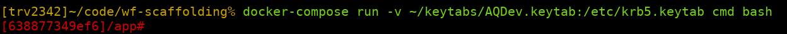

Scaffolding
===========


**Scaffolding is a setup that allows you to easily deploy Hive and Spark workflows
from your local computer into your personal Hadoop space.**

It is intended to provide the necessary tools to create a fast development
cycle in which you can deploy and run your workflows fast after each
modification.

It consists of three parts:

* A Docker image that contains all the necessary configuration for trivago's
  HDFS, Hive, Oozie and Kerberos (mpops/hadoop-cli)
* This repository with an example project that you can use as a template or
  example for your own projects
* A set of commands to initialize, deploy and run your workflows
  (trv-scaffolding)

To use this repository the only dependency is to have Docker installed.

The Docker image
----------------

The Docker image gives you a command line that is configured to connect to
trivago's Hadoop cluster. You only have to pass your Kerberos keytab and
it will automatically map the contents of this repository to the `/app`
directory inside the container.

To start it, at the root of this repository, execute:
```
docker-compose run -v </PATH/TO/MY.KEYTAB>:/etc/krb5.keytab cmd bash
```
That will start a command line inside the container (you'll recognize that
because the prompt of the command line will become red):



### The /app directory

The current working directory when you start the container is `/app`. This
directory is mapped to the directory in your local machine where you have
this repository. That means that you can change anything in the code and the
changes will be immediately visible inside the container. The `/app` directory
is the only connection between your local machine filesystem and the Docker
container, all the rest of the directories inside the container are isolated
from whatever you have in your machine.

### What you can do inside the container

The container is configured to connect to HDFS, Hive and Oozie from the command
line. For example the following commands are available:

* `hadoop fs`: copy files from/to HDFS. [Docs](https://hadoop.apache.org/docs/r2.6.0/hadoop-project-dist/hadoop-common/FileSystemShell.html)
* `start-beeline`: start an interactive shell to send queries to Hive
* `oozie`: interact with Oozie from the command line [Docs](https://oozie.apache.org/docs/5.2.0/DG_CommandLineTool.html)

You have these commands available to you, but if what you want is to just deploy
and run your workflows, you'll be more interested in the commands described in
the next section.

This repository
---------------

This repository can be used as a template or as an example for your own
projects. It contains two example workflows (a Hive one and a Spark one) to
showcase how a project can be configured.

The overall structure of the project is:

```
app/
├── db                            # generic database scripts that don't belong to any wf in particular
├── conf
│   ├── default.properties        # job.properties is created by merging `default.properties` and
│   ├── <user>.properties         # `<user>.properties` (if it exists). `<user>` is the keytab user.
│   └── env
│       └── requirements.txt      # Python dependencies of your application (always provide exact versions)
└── src                           # your application source code
    ├── app
    │   ├── <workflow-1>          # a workflow directory
    │   │   ├── run.py            # entrypoint of the Spark code
    │   │   └── workflow.xml
    │   ├── <workflow-2>          # another workflow directory
    │   │   └── workflow.xml
    │   └── coordinator.xml
    └── lib                       # generic code of your application
```

The provided example code should work out of the box and you should be able to
initialize, deploy and run it directly from the command line.

The two example workflows provided are:

* `example_hive_wf`: writes an UUID in the one-column table
  `<user>_scaffolding.uuids` table every time it is executed.
* `example_spark_wf`: writes timestamp in the one-column table
  `<user>_scaffolding.ticker` table every time it is executed.

Of course, you can clone the repo with the name of your project and replace the
example workflows with your ones in order to use this repo as a template.

**Note**: The philosophy behind this structure is that you keep workflows
that are related to each other inside the same repository and unrelated
workflows in different ones. Sometimes there's a fuzzy boundary between
workflows that are related and the ones that are not. One good test to decide
when to put them together or not is to think if you need them to be always
deployed at the same time. If you could deploy them independently, chances are
that they can go into different repos.

Development commands (trv-scaffolding)
--------------------------------------

[trv-scaffolding](http://git.trivago.trv/projects/MP-DS/repos/trv-scaffolding/browse)
is a Python package, already present in the image, that provides several
commands to work with your workflows:

* `db-init`: initialize the database in a user space
* `deploy-src`: package and deploy your code
* `deploy-env`: package and deploy your workflow Spark dependencies
* `submit`: run your workflow
* `submit-coord`: run your coordinator
* `validate`: validate the syntax of your Oozie files

A typical development session using these commands might look like this:

1. Initialize the db with `db-init` (only once or anytime that
   there's a change in the schema of the db)
2. Deploy Spark dependencies, if any (only once or anytime the list of
   dependencies change)
3. Validate your Oozie files (only once or anytime your Oozie files change)
4. Work in your code
5. Deploy your code with `deploy-src`
6. Execute it with `submit`
7. Back to 4

After deploying your project using them, it will look like this:
```
/user/<user>/db/<project>.db    # Hive database
/user/<user>/<project>/src/     # unpackaged source code files + Oozie files
/user/<user>/<project>/src.zip  # packaged source to be used by PySpark workflows
/user/<user>/<project>/env.zip  # Conda environment with dependencies for PySpark workflows
/user/<user>/<project>/RELEASE  # Info on the user and timestamp of the deployment
```

And your Hive database will be named as:
```
<user>_<project>
```

## db-init

This command allows you to initialize the database of the project in your user
space. It works by providing a list of scripts that will be executed
sequentially to create the database, the tables and initializing them with data
if necessary.

To configure it, edit the `pyproject.toml` file at the root of the repository:
```
[tool.scaffolding]
project = "myproject"
db_init_scripts = [
    "db/create_db.sql",
    "src/app/example_spark_wf/tables/ticker.sql",
    "src/app/example_hive_wf/tables/uuids.sql",
]
```
Set the name of your project (important!) and the list of SQL scripts to be
executed to initialize the database.

Note:

* The script can be located anywhere inside the repository, just specify them
  with routes relative to its root. SQL scripts that are generic to all
  workflows in the repository can be stored in the top level `db/` folder:
  ```
  db/create_db.sql
  ```
  Tables that are particular to a specific workflow can be stored in the
  specific workflow folder:
  ```
  src/app/example_spark_wf/tables/ticker.sql
  ```

* Each SQL script is passed several variables that can be used to parametrize
  it:

  - `user`: username of the keytab file that is being used
  - `project`: the name of the project in the `pyproject.toml` file
  - `db`: the database name with the structure `<user>_<project>` (if `user` or
    `project` contain dashes, `-`, they are replaced by underscores `_` in this
    variable).

   For example, to create a table, you can do:
   ```
   CREATE EXTERNAL TABLE {{ db }}.ticker (
       timestamp STRING
   )
   LOCATION 'hdfs://nameservice1/user/{{ user }}/db/{{ project }}.db/ticker';
   ```
   This allows to create the database and tables for each user of the repository
   in their own spaces without conflicting with each other.

   Note: You can use any [Jinja2 syntax](https://jinja.palletsprojects.com/en/2.11.x/templates/)
   in your db-init SQL files, although most of the time you just need to put the
   variables in the correct places with `{{ variable }}`.

   **Important**: Note that `db-init` SQL scripts use the `{{ variable }}` syntax
   for parameters, while normal Hive `.hql` files of your workflow will use
   `${variable}`, don't mix them!

Once you have your scripts ready and listed in `pyproject.toml`, you can see a
preview of what will be sent to Hive with:
```
db-init
```
To actually execute them you have to do:
```
db-init --execute
```

**Important**: For now, Scaffolding won't delete the database for you if you
want to recreate it. For safety reasons you have to do that manually. So if you
want to start from a blank state, you can do something like:

You can get a Hive command line by executing `start-beeline`. Then you can
delete the database with:
```
DROP DATABASE <database_name> cascade;
```

Then you can delete the database files (if necessary) with:
```
hadoop fs -rm -r /user/<user>/db/<project>.db
```

## deploy-env

You can specify the Python dependencies of your PySpark workflows (in case you
have any), in the file:
```
conf/env/requirements.txt
```
At the bare minimum, you have to specify these two inside it:
```
python=3.7.4
pyspark=2.4.3
```
But you can also add any Python package that you want to use. For example, if
you want to use pandas, your `requirements.txt` file can look like this one:
```
python=3.7.4
pyspark=2.4.3
pandas=0.25.3
```
Remember to always specify the exact version you want to use to prevent the
workflow breaking because of changes in the dependencies.

Once you have your requirements file ready, you can execute:
```
deploy-env
```
This will create a Conda environment and copy it to:
```
/user/<user>/<project>/env.zip
```
so it will be available for all your Spark workflows.

**Important**: executing `deploy-env` takes some time because the generated
Conda environment is a big file, notice however that you only have to use it if
you have Spark workflows and only when you change your dependencies in your
`requirements.txt` file. If you don't change your dependencies, you can deploy
the environment only once and just do `deploy-src` when you change your code.

## deploy-src

`deploy-src` is one of the most important commands in the set. It is the
one that allows you to deploy your code directly to HDFS and it will probably
the one that you execute the most if you use Scaffolding.

The command does three things:

* Copies your code to HDFS (`<your-project>/src/`) 
* Packages your code into a zip file that Spark workflows can use and copies it
  to HDFS (`<your-project>/src.zip`)
* Creates a copy of `job.properties` next to every `workflow.xml` and
  `coordinator.xml` file in HDFS

### The command

To execute the command, you just have to type:
```
deploy-src
```
You'll see some output with the logs for the steps outlined above. Make sure you
read the next sections on how to configure your project for this command to work
correctly.

After the execution, your project will look like:
```
/user/<user>/<project>/src/
/user/<user>/<project>/src.zip
```

**Important**: Every time that you deploy, the contents of `src/` in HDFS are
deleted and replaced with the new version of the code. Never make manual changes
directly there or store anything in that folder as those modification will be
lost during next redeployment.

### Structure of the code

`deploy-src` doesn't make too many assumptions about the structure of your code,
it just deploys whatever you have in `src/`. And you can have any combination of
Hive and Spark workflows or just workflows of one kind or the other.

However, the following structure is recommended:
```
src                           # your application source code
├── app
│   ├── <workflow-1>          # a workflow directory
│   │   ├── run.py            # entrypoint of the Spark code
│   │   └── workflow.xml
│   ├── <workflow-2>          # another workflow directory
│   │   └── workflow.xml
│   └── coordinator.xml
└── lib                       # generic code of your application
    └── my_utility.py
```

* `app/`: contains all the business specific code (your Hive or Spark workflows)
* `lib/`: contains generic functions to be used across Spark workflows

The contents of the `workflow.xml` and `coordinator.xml` are up to you. However,
examples are provided so you can see how to reference files such as `src.zip`
and `env.zip` in your Spark workflows.

For PySpark workflows, it is a good idea to name `run.py` to the file that
serves as entrypoint of the workflow (the one referred from `workflow.xml`).

**Important**: All the content of `src/` is placed in the `PYTHONPATH`, that
means that you can import anything inside `src/` like this:
```
from app.my_worflow import foo
from lib.date_utils import bar
```

**Note**: If you have truly generic code, consider moving it to an actual
Python package instead of having it stored in `lib/`, and have it listed inside
your `requirements.txt` file. You can use the `lib/` folder for code that is
common across several workflows or as a first step before creating a Python
library when you are working on it very frequently and deploying a separate
package for every change is too much of a hassle.

### How job.properties is computed

Scaffolding allows you to parametrize the workflows for your personal user
without having to touch the production *properties* file. For example, you can
have a variable for which table should be used to export final results and that
can be set to the actual table in production, while it can be set to a local
table in your personal workspace for your own development.

All *property* files are saved in `conf/`, and the file:
```
    conf/default.properties
```
contains the default values that are used in all cases.

Then you can add (optionally) other files with the format:
```
    conf/<keytab-username>.properties
```
that will override the values in `default.properties` when Scaffolding generates
the final `job.properties` file.

For example, if the current Kerberos user is `AQDev`, the files:
```
# default.properties
variable1=foo
variable2=bar
```
and:
```
# AQDev.properties
variable2=spam
variable3=eggs
```
will generate the following `job.properties` file during deployment:
```
variable1=foo
variable2=spam
variable3=eggs
```

So, in summary, if you don't need to parametrize the workflows for your personal
user, just use `default.properties` which will be converted into
`job.properties` during deployment. If you do need to override certain values,
add a file with the name of your Kerberos user and add to it only the variables
that you want to change.

**Note**: if you want to see which properties will be actually used, just
execute `get-properties` in the command line and the final values will be
printed on the screen.

**Note**: when adding a `<kerberos-username>.properties` file, remember that the
name matching is case sensitive, so name the file exactly as your user in
Hadoop.

**Note**: the `job.properties` file is generated on the fly every time you
execute `deploy-src`, and a copy of it is deployed next to every `workflow.xml`
and `coordinator.xml` file.

### Don't forget the README file!

This repository provides a `README-project.md` file that you can use as a
template for the README file of your own projects. If you cloned this repo with
the intention of using it as a template, you can delete the file you're right
now reading and rename `README-project.md` to `README.md`.

## submit

Once you have your code deployed you may, very likely, try to execute it. You
can go to the HUE web interface and just submit any of the workflows of the
project (a `job.properties` is generate in each one, so you'll probably only
need to enter the crunch date or any other missing parameter in the UI when
doing so), or you can do it using the `submit` command:
```
submit src/app/some-workflow 20200202
```
Your workflow will be submitted with the current properties of your project (by
merging `default.properties` and the properties for your user -if present) and
the passed crunch date.

After executing the command, you'll get an URL to track the execution of the
job. Click on it or copy/paste it in a browser to see it.

## submit-coord

In the same way that you can submit a workflow, you can also submit a
coordinator. In this case you don't need to specify a crunch date since the
dates for it will be taken from the properties files. Eg:
```
submit-coord src/app/
```
The directory to specify is the one where the `coordinator.xml` is located.
After submitting your coordinator you'll get an URL to follow its execution.

## validate

`validate` is a very straightforward command to use:
```
validate
```
If you execute it, it will look for all `workflow.xml` and `coordinator.xml`
files inside `src/` and verify using Oozie that their syntax is correct.

Other commands
--------------

Apart from the above mentioned commands, scaffolding includes Black to
automatically format Python code. If you want to use it, execute:
```
black /app/src
```
inside the Docker container.

Also, outside the Docker container, you can run:
```
make init
```
To install a `black` check as a pre-commit hook. That means that if you try to
commit code that doesn't conform to Black rules, the commit will be aborted.
You can fix your code by running `black` itself and adding and committing the
reformatted files again.

